# Sweet Box System Architecture & Capstone Manuscript Diagrams
**Project Title:** Centralized Analytics System with Inventory Management and AI-Driven Prescriptive Decision Support for Multi-Branch Operations of Sweet Box  
**Repository Location:** `d:\SB\docs\diagrams\`  
**Target Manuscript File:** `capstone-09_29_26.pdf`  
**Last Updated:** September 2026  

---

## Directory Overview
- `src/Figure_1_Conceptual_Framework.mmd` - Conceptual Framework (IPO Model)
- `src/Figure_2_Agile_Development_Cycle.mmd` - Agile Development Methodology Cycle
- `src/Figure_3A_Process_Flow_Existing.mmd` - Existing Manual Workflow with Loyverse
- `src/Figure_3B_Process_Flow_Proposed.mmd` - Proposed Integrated Two-Phase System Workflow
- `src/Figure_4_Use_Case_Diagram.mmd` - Complete Multi-Role Use Case Diagram
- `src/Figure_5_Context_Diagram.mmd` - System Context Diagram (Level 0)
- `src/Figure_6_System_Architecture.mmd` - 4-Tier Enterprise Architecture Diagram
- `src/Figure_7_Data_Flow_Diagram_Level_1.mmd` - Level 1 Data Flow Diagram (DFD)
- `src/Figure_8_Point_of_Sale_ERD.mmd` - Point-of-Sale Module Database ERD
- `src/Figure_9_Inventory_Management_ERD.mmd` - Inventory & SCM Module Database ERD
- `src/Figure_10_Prescriptive_Analytics_ERD.mmd` - Analytics & Prescriptive Engine Database ERD
- `src/Figure_11_Accounts_and_Authentication_ERD.mmd` - User Accounts & 2FA Database ERD
- `view_diagrams.html` - Interactive standalone HTML browser viewer with vector SVG export

---

## Figure 1: Conceptual Framework Diagram
**Description:** Illustrates the Input-Process-Output (IPO) architecture of the Sweet Box Enterprise System. Inputs encompass multi-branch transactional sales, digital BOM recipes, and contextual external variables (holidays/paydays). The process layer integrates deterministic rule-based monitoring, mathematical warehouse constraint bounding, and the Google GenAI prescriptive engine (`gemini-2.5-flash`). The outputs deliver operational production directives, bounded restocking recommendations, and enterprise decision-support dashboards.

```mermaid
flowchart TD
    subgraph INPUT["INPUT: User Roles & Multi-Branch Enterprise Data"]
        direction TB
        ROLES["<b>User Roles:</b><br/>Business Owner • Branch Manager • Front Staff • System Administrator"]
        
        subgraph INPUT_DATA["Input Data Categories"]
            direction LR
            D_USER["<b>User & Transaction Data:</b><br/>• Transaction Items<br/>• Payment Tenders<br/>• Cashier Identity<br/>• Branch Assignment"]
            D_INV["<b>Inventory & Operations Data:</b><br/>• Ingredient & Product Stocks<br/>• Manual Stock Adjustments<br/>• Restock Requests<br/>• Bill of Materials (BOM)"]
            D_SYS["<b>Analytics & Context Data:</b><br/>• 180-Day Sales Velocity<br/>• External Variables (Holidays/Paydays)<br/>• Operational Constraints (MOQ/Capacity)<br/>• Audit Trails"]
        end
        ROLES --> INPUT_DATA
    end

    subgraph PROCESS["PROCESS: Business Analytics & Decision Engine"]
        direction TB
        ETL["<b>Data Integration & ETL Pipeline:</b><br/>Data Validation • Axios Polling • Batch Aggregation • Automated Data Archiving"]
        
        subgraph ENGINES["Processing Subsystems"]
            direction LR
            P_MON["<b>Deterministic Monitoring:</b><br/>• Real-Time Stock Status<br/>• 3-Tier Health Alerting<br/>• Automated COGS Tracking<br/>• KPI Formula Computations"]
            P_AI["<b>Gemini AI Prescriptive Engine:</b><br/>• Restock Quantities & Deadlines<br/>• Production Target Advice<br/>• Natural Language Rationale<br/>• Sales Analyst Chatbot"]
            P_BOUND["<b>Constraint Bounding & Fallback:</b><br/>• Physical Capacity Clamping<br/>• Supplier MOQ Enforcement<br/>• Algorithmic Replenishment Fallback"]
        end
        
        ETL --> ENGINES
        
        DB[("<b>Centralized MySQL Database</b><br/>Master Data • Transactions • Inventory Stocks • Constraints • Prescriptions • Archives")]
        ENGINES <--> DB
    end

    subgraph OUTPUT["OUTPUT: Operational Intelligence & Decision Support"]
        direction LR
        O_PROD["<b>Production Directives:</b><br/>• Batch Production Targets<br/>• Hub Raw Ingredient Planning<br/>• Kitchen Deduction Logs"]
        O_RESTOCK["<b>Prescriptive Restock:</b><br/>• Feasibility-Bounded Reorders<br/>• Urgency & Order Deadlines<br/>• Estimated Procurement Cost"]
        O_DASH["<b>Enterprise Dashboards:</b><br/>• Cross-Branch Revenue & Trends<br/>• Inventory Turnover & GMROI<br/>• Branch Target Accomplishment"]
        O_MGMT["<b>Decision Support & Control:</b><br/>• Managerial Approval / Override<br/>• Conversational Chatbot Guidance<br/>• Digital Receipts & KPI CSV Exports"]
    end

    INPUT --> PROCESS
    PROCESS --> OUTPUT
```

---

## Figure 2: Agile Development Methodology Cycle
**Description:** Depicts the five-phase iterative Agile workflow governing the software development lifecycle: Planning & Problem Identification, System Design, Backend & Frontend Development, Testing & Verification, and Client Review / Cloud Deployment.

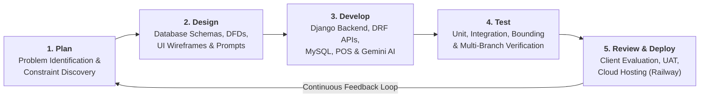

---

## Figure 3A: Existing Manual Workflow (Manuscript Baseline)
**Description:** Details the baseline operational process of Sweet Box under Loyverse POS, highlighting manual ingredient physical counts, reactive restock orders via telephone, and delayed end-of-day reconciliation.

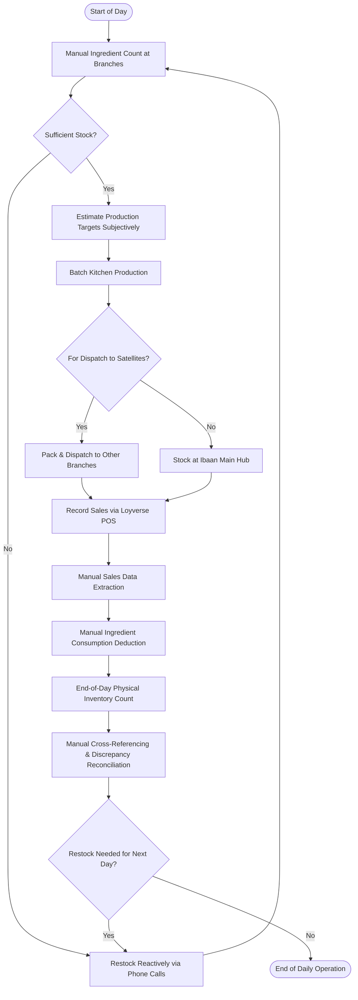

---

## Figure 3B: Proposed Integrated System Workflow (Validated System)
**Description:** Illustrates the optimized operational workflow incorporating automated two-phase inventory tracking: Batch Kitchen BOM deductions convert raw materials into finished goods, and POS terminal sales deduct finished goods directly with automatic feasibility-bounded restock recommendations.

```mermaid
flowchart TD
    START([Start of Operational Day]) --> ETL_CHECK[System Checks Real-Time Inventory & Constraints]
    ETL_CHECK --> AI_PROD[Gemini AI Generates Feasible Production Targets]
    AI_PROD --> MGR_APP{Branch Manager Approves?}
    MGR_APP -- Override --> MGR_EDIT[Manager Overrides Target & Logs Reason]
    MGR_APP -- Approve --> PROD_EXEC[Execute Kitchen Production via System]
    MGR_EDIT --> PROD_EXEC
    
    PROD_EXEC --> BOM_DEDUCT["<b>Phase 1: Automated BOM Deduction</b><br/>(Deducts Raw Ingredients from Kitchen/Hub Stock)"]
    BOM_DEDUCT --> PROD_INC["Increment Available Finished ProductStock"]
    
    PROD_INC --> DISPATCH_CHECK{Transfer Finished Goods to Satellites?}
    DISPATCH_CHECK -- Yes --> TRANS_EXEC["Execute Inter-Branch Product Transfer<br/>(select_for_update concurrency lock)"]
    DISPATCH_CHECK -- No --> READY_SALE[Ready for Point-of-Sale Service]
    TRANS_EXEC --> READY_SALE
    
    READY_SALE --> POS_TXN["Front Staff Processes Sale at Cashier Terminal"]
    POS_TXN --> FG_DEDUCT["<b>Phase 2: Finished Goods Deduction</b><br/>(Deducts directly from Branch ProductStock)"]
    FG_DEDUCT --> RECORD_TXN["Save Transaction, Items, & Tender to MySQL"]
    
    RECORD_TXN --> THRESHOLD{Stock Quantity <= Reorder Threshold?}
    THRESHOLD -- Yes --> AI_RESTOCK["Trigger Gemini AI Prescriptive Restock Directive<br/>(Feasibility-Bounded via Storage & MOQ Limits)"]
    THRESHOLD -- No --> CONTINUOUS[Continuous Operation / Live Dashboard Update]
    AI_RESTOCK --> OWNER_REV{Business Owner Approves Restock?}
    OWNER_REV -- Yes --> AUTO_TRANSFER[Execute Inter-Branch Restock Transfer]
    OWNER_REV -- Reject --> LOG_OVERRIDE[Log Override Reason to Database]
    AUTO_TRANSFER --> CONTINUOUS
    LOG_OVERRIDE --> CONTINUOUS
    CONTINUOUS --> EOD([End of Day Automated Batch ETL & Archiving])
```

---

## Figure 4: Use Case Diagram
**Description:** Maps system capabilities across the four official operational roles (Front Staff, Branch Manager, Business Owner, and System Administrator) utilizing UML stick figures for actor representation. Inventory management is handled directly by the Branch Manager, while the Business Owner oversees executive analytics, approvals, and recipe management. A publication-grade standalone vector file is also provided at [`Figure_4_Use_Case_Diagram.svg`](Figure_4_Use_Case_Diagram.svg).

```mermaid
%%{init: {
  'theme': 'base',
  'themeVariables': {
    'primaryColor': '#FFFFFF',
    'primaryTextColor': '#000000',
    'primaryBorderColor': '#000000',
    'lineColor': '#000000',
    'secondaryColor': '#FFFFFF',
    'tertiaryColor': '#FFFFFF',
    'mainBkg': '#FFFFFF',
    'nodeBorder': '#000000',
    'clusterBkg': '#FFFFFF',
    'clusterBorder': '#000000',
    'edgeLabelBackground': '#FFFFFF',
    'textColor': '#000000'
  }
}}%%
flowchart LR
    subgraph ACTORS["System Actors (4 Official Roles)"]
        FS["<svg width='32' height='46' viewBox='0 0 32 46'><circle cx='16' cy='8' r='6' fill='none' stroke='black' stroke-width='2'/><line x1='16' y1='14' x2='16' y2='28' stroke='black' stroke-width='2'/><line x1='4' y1='19' x2='28' y2='19' stroke='black' stroke-width='2'/><line x1='16' y1='28' x2='8' y2='42' stroke='black' stroke-width='2'/><line x1='16' y1='28' x2='24' y2='42' stroke='black' stroke-width='2'/></svg><br/><b>Front Staff</b>"]
        BM["<svg width='32' height='46' viewBox='0 0 32 46'><circle cx='16' cy='8' r='6' fill='none' stroke='black' stroke-width='2'/><line x1='16' y1='14' x2='16' y2='28' stroke='black' stroke-width='2'/><line x1='4' y1='19' x2='28' y2='19' stroke='black' stroke-width='2'/><line x1='16' y1='28' x2='8' y2='42' stroke='black' stroke-width='2'/><line x1='16' y1='28' x2='24' y2='42' stroke='black' stroke-width='2'/></svg><br/><b>Branch Manager</b>"]
        BO["<svg width='32' height='46' viewBox='0 0 32 46'><circle cx='16' cy='8' r='6' fill='none' stroke='black' stroke-width='2'/><line x1='16' y1='14' x2='16' y2='28' stroke='black' stroke-width='2'/><line x1='4' y1='19' x2='28' y2='19' stroke='black' stroke-width='2'/><line x1='16' y1='28' x2='8' y2='42' stroke='black' stroke-width='2'/><line x1='16' y1='28' x2='24' y2='42' stroke='black' stroke-width='2'/></svg><br/><b>Business Owner</b>"]
        SA["<svg width='32' height='46' viewBox='0 0 32 46'><circle cx='16' cy='8' r='6' fill='none' stroke='black' stroke-width='2'/><line x1='16' y1='14' x2='16' y2='28' stroke='black' stroke-width='2'/><line x1='4' y1='19' x2='28' y2='19' stroke='black' stroke-width='2'/><line x1='16' y1='28' x2='8' y2='42' stroke='black' stroke-width='2'/><line x1='16' y1='28' x2='24' y2='42' stroke='black' stroke-width='2'/></svg><br/><b>System Administrator</b>"]
    end

    subgraph POS_CASES["Point-of-Sale Module"]
        UC_TXN(["Process Sale Transaction"])
        UC_PAY(["Record Payment (Cash/E-Wallet/Split)"])
        UC_DISC(["Apply Transaction Discount"])
        UC_HIST(["View Branch Transaction History"])
        UC_REFUND(["Process Transaction Refund"])
        UC_RCPT(["Print / Download Digital Receipt"])
    end

    subgraph SCM_CASES["Inventory Management & Kitchen Production (BOM)"]
        UC_LIVE(["View Live Multi-Branch Stock"])
        UC_ADJ(["Record Manual Stock Adjustment"])
        UC_PROD(["Execute Kitchen Batch Production (BOM)"])
        UC_TRANS(["Perform Inter-Branch Product Transfer"])
        UC_REQ_SUB(["Submit Restock Request"])
        UC_REQ_APP(["Approve / Reject Restock Request"])
        UC_BOM_MGT(["Manage BOM Recipe Configurations"])
        UC_ING_ADD(["Register New Master Ingredient"])
    end

    subgraph AI_CASES["Prescriptive Analytics & Decision Support"]
        UC_DASH(["View Enterprise KPI Dashboard"])
        UC_PRESC_VIEW(["View Prescriptive Action Cards"])
        UC_PRESC_DEC(["Approve / Override AI Recommendations"])
        UC_CHAT(["Consult AI Sales Analyst Chatbot"])
        UC_EXT_VAR(["Manage Contextual External Variables"])
        UC_ETL(["Execute ETL Pipeline & Data Archival"])
        UC_CSV(["Export Enterprise KPI CSV Report"])
    end

    subgraph ADMIN_CASES["System Administration & Security"]
        UC_USER(["Manage User Accounts & Branches"])
        UC_AUDIT(["Inspect System Audit Logs"])
        UC_2FA(["Verify Two-Factor Auth (OTP/Trusted Token)"])
    end

    %% Explicit Black and White Styling
    classDef default fill:#FFFFFF,stroke:#000000,stroke-width:1.5px,color:#000000;
    classDef actorNode fill:#FFFFFF,stroke:none,color:#000000;
    classDef usecaseNode fill:#FFFFFF,stroke:#000000,stroke-width:1.5px,color:#000000;

    class FS,BM,BO,SA actorNode;
    class UC_TXN,UC_PAY,UC_DISC,UC_HIST,UC_REFUND,UC_RCPT,UC_LIVE,UC_ADJ,UC_PROD,UC_TRANS,UC_REQ_SUB,UC_REQ_APP,UC_BOM_MGT,UC_ING_ADD,UC_DASH,UC_PRESC_VIEW,UC_PRESC_DEC,UC_CHAT,UC_EXT_VAR,UC_ETL,UC_CSV,UC_USER,UC_AUDIT,UC_2FA usecaseNode;

    style ACTORS fill:#FFFFFF,stroke:#000000,stroke-width:1.5px,color:#000000;
    style POS_CASES fill:#FFFFFF,stroke:#000000,stroke-width:1.5px,color:#000000;
    style SCM_CASES fill:#FFFFFF,stroke:#000000,stroke-width:1.5px,color:#000000;
    style AI_CASES fill:#FFFFFF,stroke:#000000,stroke-width:1.5px,color:#000000;
    style ADMIN_CASES fill:#FFFFFF,stroke:#000000,stroke-width:1.5px,color:#000000;

    %% Front Staff Associations
    FS --> UC_TXN
    FS --> UC_PAY
    FS --> UC_DISC
    FS --> UC_HIST
    FS --> UC_REFUND
    FS --> UC_RCPT
    FS --> UC_2FA

    %% Branch Manager Associations (Handles store operations, shift history, and all branch inventory management)
    BM --> UC_HIST
    BM --> UC_LIVE
    BM --> UC_ADJ
    BM --> UC_PROD
    BM --> UC_TRANS
    BM --> UC_REQ_SUB
    BM --> UC_PRESC_VIEW
    BM --> UC_2FA

    %% Business Owner Associations (Executive oversight, restock approvals, BOM recipes, full analytics, chatbot)
    BO --> UC_DASH
    BO --> UC_LIVE
    BO --> UC_REQ_APP
    BO --> UC_PROD
    BO --> UC_TRANS
    BO --> UC_BOM_MGT
    BO --> UC_ING_ADD
    BO --> UC_PRESC_VIEW
    BO --> UC_PRESC_DEC
    BO --> UC_CHAT
    BO --> UC_EXT_VAR
    BO --> UC_ETL
    BO --> UC_CSV
    BO --> UC_2FA

    %% System Administrator Associations (User management, audit trails, and system maintenance)
    SA --> UC_USER
    SA --> UC_AUDIT
    SA --> UC_EXT_VAR
    SA --> UC_ETL
    SA --> UC_2FA
```

---

## Figure 5: Context Diagram (Level 0)
**Description:** Defines boundary data flows between the centralized Sweet Box enterprise system and the four official external entities: Front Staff, Branch Manager, Business Owner, and System Administrator. Inventory operations are consolidated under the Branch Manager, and executive governance is routed to the Business Owner.

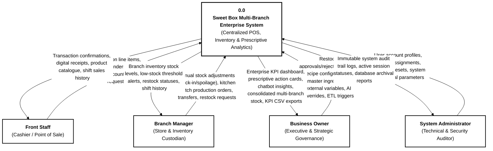

---

## Figure 6: System Architecture Diagram
**Description:** Represents the 4-tier enterprise system architecture: Presentation Layer (HTML5/Bootstrap/Chart.js), Security & API Layer (DRF/SimpleJWT/2FA/HTTPS), Core Application Logic Layer (Django Service Layer & `google-genai` SDK calling `gemini-2.5-flash`), and Data Storage Layer (MySQL 8.0 & Cold JSON ArchiveStorage).

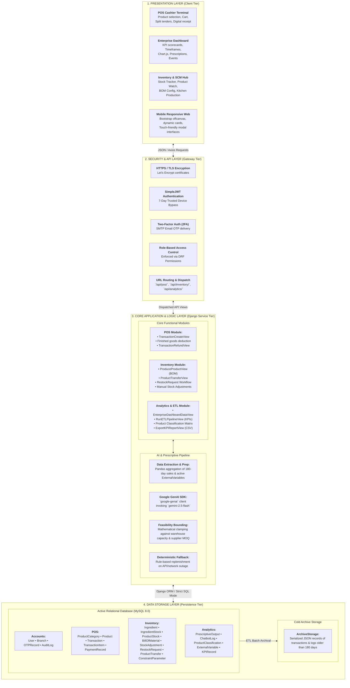

---

## Figure 7: Data Flow Diagram (Level 1 DFD)
**Description:** Deconstructs core enterprise transactions and analytical processes across the four official system entities: Front Staff, Branch Manager, Business Owner, and System Administrator. Demonstrates data flows into data stores D1 through D6, automated batch ETL processing, and 180-day cold archival storage in strict black-and-white academic format.

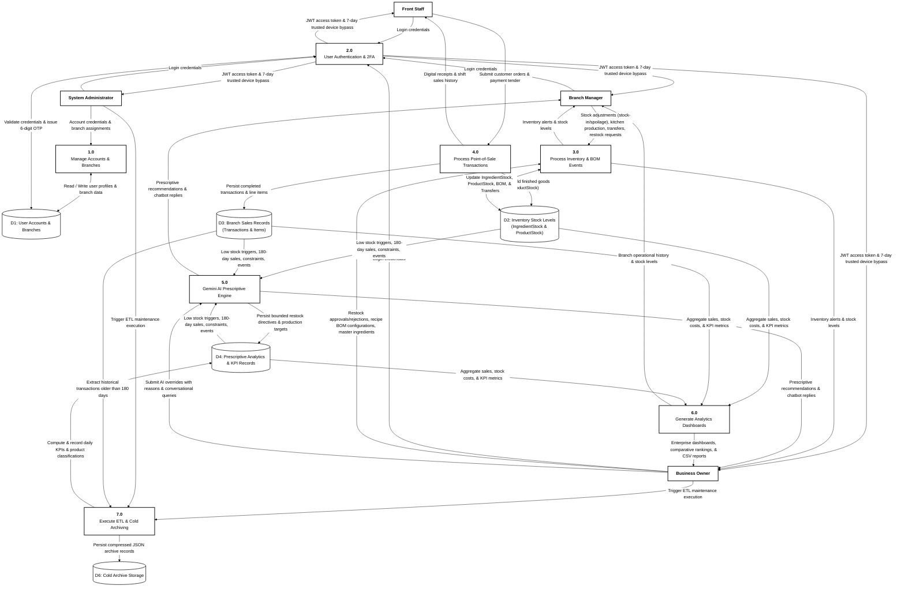

---

## Figure 8: Point-of-Sale Module Database ERD
**Description:** Validated ERD defining the transactional core: `BRANCHES`, `USERS`, `PRODUCT_CATEGORIES`, `PRODUCTS`, `TRANSACTIONS`, `TRANSACTION_ITEMS`, and `PAYMENT_RECORDS`.

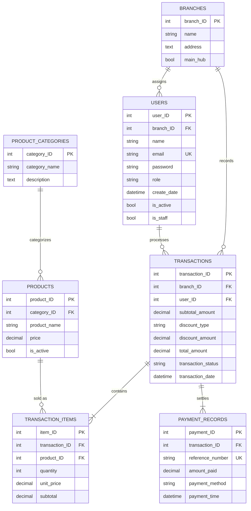

---

## Figure 9: Inventory Management Module Database ERD
**Description:** Corrected and completed ERD. Fixes `PRODUCTS.price`, adds `INGREDIENTS.category_ID FK`, and introduces the implemented `PRODUCT_TRANSFERS` table.

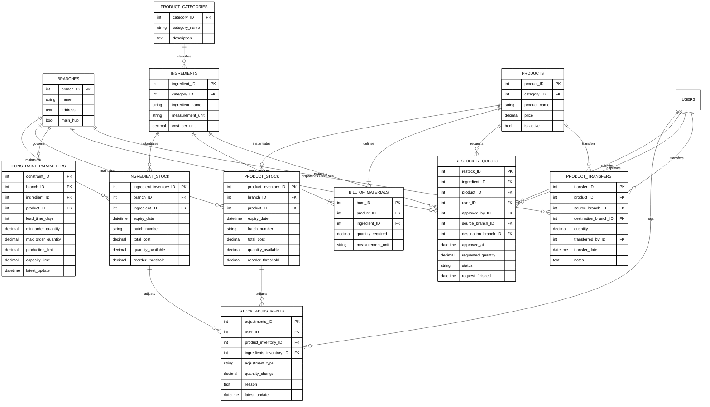

---

## Figure 10: Prescriptive Analytics Dashboard Module Database ERD
**Description:** Corrected ERD removing the invalid `branch_ID` from `PRODUCT_CLASSIFICATION`, updating `ARCHIVE_STORAGE` to `module_table`/`record_ID`, correcting `CHATBOT_LOGS` PK to `chatbot_log_ID`, and adding `is_overridden`/`override_reason` to `PRESCRIPTIVE_OUTPUTS`.

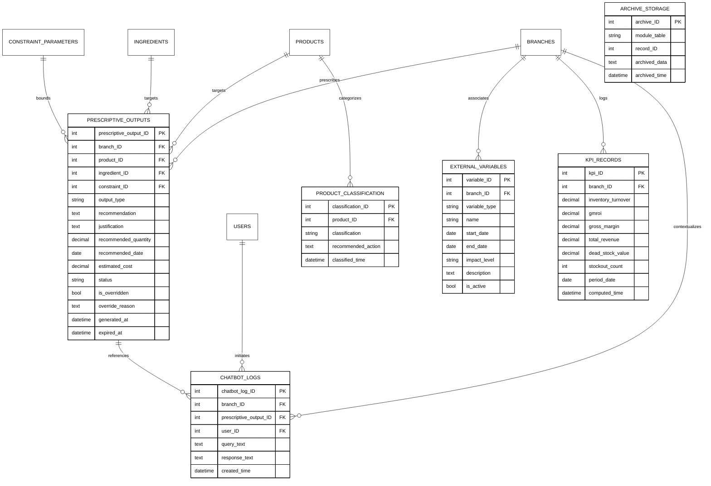

---

## Figure 11: Accounts and User Authentication ERD
**Description:** Validated ERD defining user profiles, 6-digit email OTPs, and the immutable audit log ledger. The `UK` constraint on `otp_code` has been removed.

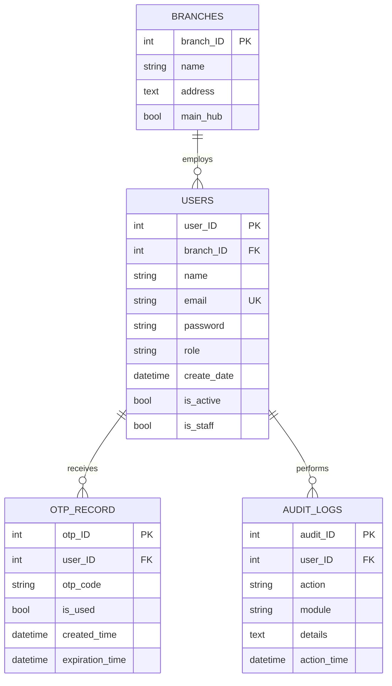
